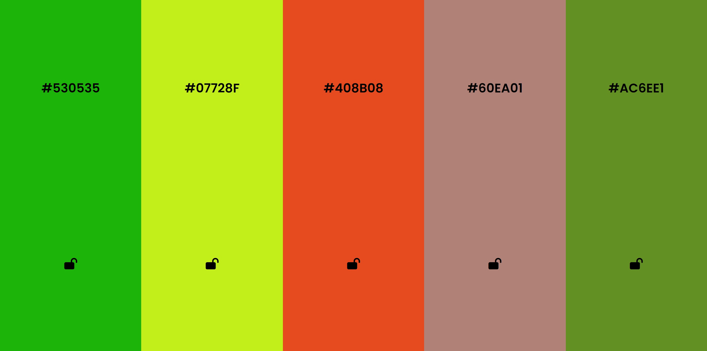

<h1><a href="https://sadykzhanovs.github.io/random-color" target="_blank">Random Color.</a></h1>

Random color is a site for issuing random colors, developed in HTML, CSS, JavaScript. Adaptive on all devices.

